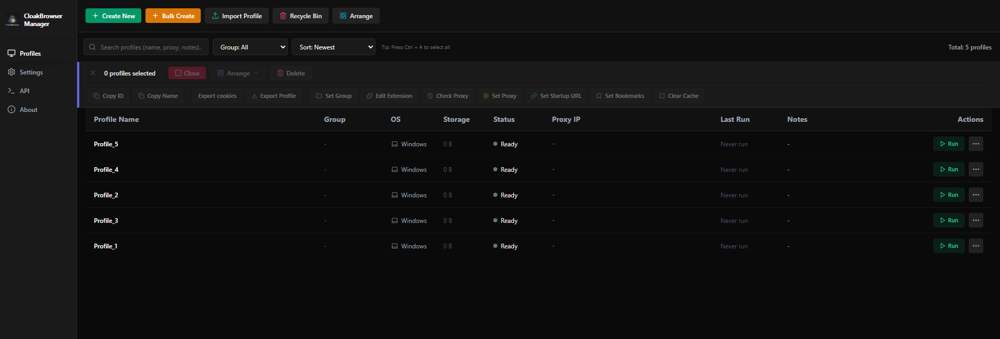

# CloakBrowser Manager

Hệ thống quản lý profile trình duyệt antidetect chuyên nghiệp, tự lưu trữ (self-hosted), sử dụng nhân trình duyệt **CloakBrowser** (Chromium tùy biến chống phát hiện). Cho phép tạo, quản lý và tự động hóa hàng loạt profile độc lập với các dấu vân tay số độc bản.

<p align="center">
  
  <br><br>
  
</p>

---

## 💡 Bối cảnh dự án

Dự án **CloakBrowser** gốc tuy sở hữu công nghệ cốt lõi chống dấu vân tay (antidetect) vô cùng mạnh mẽ, nhưng lại thiếu đi giao diện quản trị trực quan và các tính năng quản lý thiết yếu như tạo hàng loạt, xuất/nhập Cookies, quản lý trạng thái và đồng bộ hóa Profile. 

Vì lý do đó, **CloakBrowser-Manager** ra đời. Bằng cách kế thừa sự tiện lợi và tối ưu trong cấu trúc giao diện của **GPM Login** kết hợp với sức mạnh antidetect của **CloakBrowser**, dự án mang lại giải pháp quản trị profile hàng loạt trực quan, dễ dùng nhất cho người dùng phổ thông lẫn các nhà phát triển tự động hóa.

---

## 🚀 Tính năng nổi bật

- **Quản lý Profile Độc Lập:** Mỗi profile có cookie, bộ nhớ cục bộ, lịch sử và cache riêng biệt, hoàn toàn cô lập.
- **Tự động hóa Vân Tay (Fingerprint Seed):** Cơ chế sinh thông số phần cứng (Canvas, WebGL, Audio, GPU, CPU Cores) tự động dựa trên `fingerprint_seed` độc bản của từng profile, đảm bảo tính tự nhiên tối đa mà không cần tinh chỉnh thủ công phức tạp.
- **Đồng bộ Vùng Địa Lý (GeoIP):** Tự động phát hiện và đồng bộ hóa múi giờ (`timezone`) và ngôn ngữ (`locale`) dựa trên vị trí địa lý của Proxy IP được gán, giúp tăng điểm tin cậy đối với các hệ thống chống bot.
- **Tự Động Cập Nhật (Auto Update):** Tự động kiểm tra và nâng cấp mã nguồn CloakBrowser cũng như nhân trình duyệt Chromium tương thích mới nhất khi khởi động Manager.
- **Tự động hóa CDP (Playwright / Puppeteer):** Hỗ trợ đầy đủ giao thức Chrome DevTools Protocol (CDP) giúp bạn dễ dàng kết nối các script tự động hóa để điều khiển trình duyệt.
- **Xem trực tiếp trong Web (VNC):** Tích hợp VNC trực tiếp trên giao diện quản trị giúp bạn theo dõi và tương tác trực quan với các profile trình duyệt đang chạy.

---

## 🛠️ Hướng dẫn cài đặt & Khởi chạy nhanh trên Windows

Ứng dụng hỗ trợ chạy trực tiếp trên Windows và cung cấp trình khởi chạy hoàn toàn tự động.

### Cách 1: Khởi chạy Tự động (Khuyên dùng cho người dùng)

Chỉ với một thao tác bấm, hệ thống sẽ tự động thiết lập toàn bộ môi trường từ đầu đến cuối:

1. **Nhấp đúp chuột vào tệp `run.bat`** ở thư mục gốc của dự án.
2. Trình khởi chạy sẽ tự động thực hiện:
   * Tạo môi trường ảo Python (`.venv`) và cài đặt các thư viện backend cần thiết.
   * Tải nhân trình duyệt Chromium tương thích của CloakBrowser.
   * Cài đặt dependencies frontend và tự động biên dịch giao diện React (`npm run build`).
   * Khởi chạy FastAPI backend ở cổng `8080`.
   * Tự động mở trình duyệt Edge hoặc Chrome trên máy của bạn dưới dạng **App cửa sổ độc lập** kết nối thẳng vào giao diện quản lý.

---

### Cách 2: Khởi chạy Thủ công (Dành cho nhà phát triển phát triển tính năng)

Nếu bạn muốn tùy chỉnh hoặc phát triển mã nguồn của ứng dụng, hãy khởi chạy thủ công hai phần riêng biệt:

#### Yêu cầu chuẩn bị
* Máy tính đã cài đặt **Python 3.10+** và **Node.js 18+**.

#### Bước 1: Khởi chạy Backend (FastAPI)
Mở một cửa sổ PowerShell hoặc Command Prompt tại thư mục dự án và chạy:
```powershell
# 1. Tạo môi trường ảo Python
python -m venv .venv

# 2. Kích hoạt môi trường ảo
.venv\Scripts\activate

# 3. Cài đặt các dependencies
pip install -r backend/requirements.txt

# 4. Thiết lập biến môi trường chỉ định thư mục lưu trữ profile
$env:DATA_DIR="D:\APP\CloakBrowser\CloakBrowser-Manager\data"

# 5. Khởi chạy backend FastAPI qua uvicorn
python -m uvicorn backend.main:app --port 8080
```

#### Bước 2: Khởi chạy Frontend (React + Vite)
Mở một cửa sổ dòng lệnh thứ hai tại thư mục dự án và chạy:
```powershell
# 1. Đi tới thư mục frontend
cd frontend

# 2. Cài đặt dependencies (chỉ cần chạy lần đầu)
npm install

# 3. Chạy Vite dev server
npm run dev
```
Sau đó truy cập địa chỉ [http://localhost:5173](http://localhost:5173) để xem giao diện phát triển có chế độ Hot-Reload.

---

## ⚙️ Cấu hình Tự động hóa (Playwright Python Sample)

Mỗi profile khi khởi chạy sẽ tự động mở một cổng CDP ngẫu nhiên (từ `5100` đến `5199`). Bạn có thể kết nối Playwright trực tiếp qua cổng CDP này:

```python
import requests
from playwright.sync_api import sync_playwright

MANAGER_URL = "http://localhost:8080"
PROFILE_ID = "UUID_CỦA_PROFILE"

def main():
    # 1. Khởi chạy profile thông qua API
    requests.post(f"{MANAGER_URL}/api/profiles/{PROFILE_ID}/launch")
    
    # 2. Lấy thông tin trạng thái profile (bao gồm CDP Port)
    status_res = requests.get(f"{MANAGER_URL}/api/profiles/{PROFILE_ID}/status")
    status_data = status_res.json()
    cdp_port = status_data.get("cdp_port") or 5100
    
    # 3. Sử dụng Playwright kết nối tới Browser Instance đang chạy
    with sync_playwright() as p:
        browser = p.chromium.connect_over_cdp(f"http://127.0.0.1:{cdp_port}")
        context = browser.contexts[0]
        page = context.pages[0] if context.pages else context.new_page()
        
        # 4. Điều khiển trình duyệt
        page.goto("https://bot-detector.rebrowser.net/")
        print("Tiêu đề trang:", page.title())
        browser.close()

if __name__ == "__main__":
    main()
```
